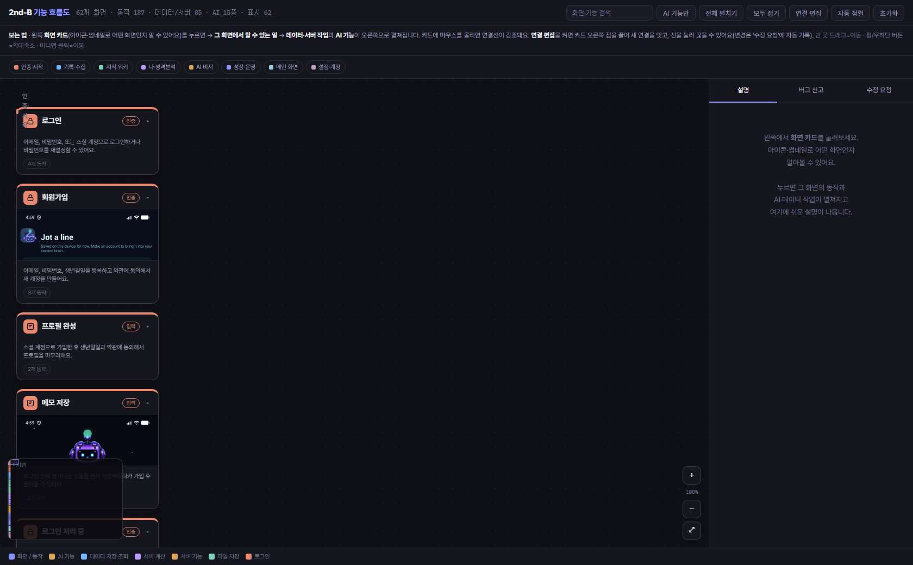
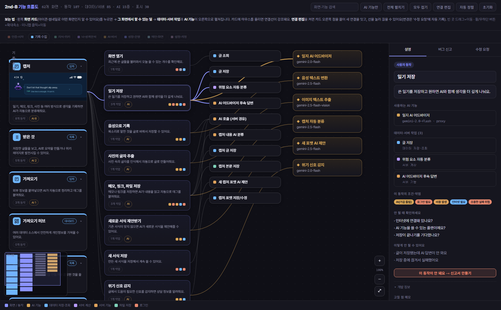

# Flow Debugger

비개발자가 자기 앱의 **워크플로우를 눈으로 보고 디버깅**하게 해주는 Claude Code 플러그인.

앱 화면을 전수 스캔해 `화면 → 사용자 동작 → 데이터/서버 작업 + AI`로 잇고, 각 동작에
**위험 마커 + 진단 체크리스트**를 붙여, "여기서 안 돼요"를 개발자가 바로 고칠 수 있는
**버그 신고서(file:line 포함)**로 바꿔 보낼 수 있는 단일 자체완결 HTML을 만든다.

외부 의존성은 스크립트 실행용 `node`뿐.

## 미리보기

화면을 그룹별로 보여주고(아이콘·실제 스크린샷 썸네일·위험 색점), 카드를 누르면 동작 -> 데이터/서버 -> AI로 펼쳐진다:



동작을 고르면 그 동작이 의존하는 것(데이터/서버/AI)이 펼쳐지고, 오른쪽 패널에 **약점·진단 체크리스트·실패 모드**와 "이 동작이 안 돼요 -> 신고서 만들기" 버튼이 뜬다:



## 설치 (플러그인)

```bash
# 1) 이 레포를 마켓플레이스로 추가
/plugin marketplace add Simon-YHKim/Flow-debugger
# 2) 플러그인 설치
/plugin install flow-debugger@flow-debugger
```

설치 후 `/flow-debugger:flow-debugger` 또는 "플로우 디버거 만들어 / 워크플로우 디버깅"으로 호출.

### 플러그인 없이 쓰기 (수동 복사)

```powershell
robocopy ".\skills\flow-debugger" "$env:USERPROFILE\.claude\skills\flow-debugger" /E
```

## 쓰는 법

스킬 발동 후 5단계 파이프라인을 돈다(프롬프트 전문: `skills/flow-debugger/references/scan-prompts.md`):

1. **스캔** 화면 → 동작 → api/ai 추출 → `merge-readers.js`로 병합
2. **한국어 보강** titleKo/summaryKo/actionKo/plain
3. **디버그 주석** risks / checklist / failureModes (이 플러그인의 핵심)
4. **스크린샷 임베드**(선택) `embed-shots.js`
5. **빌드** `build.js`로 토큰 주입 + JS 자가검증 → `flow-debugger.html`

직접 빌드 예 (스킬 폴더 기준):

```bash
node skills/flow-debugger/scripts/build.js \
  skills/flow-debugger/assets/flow-debugger.template.html \
  Output/screenmap.debug.json Output/glossary.ko.json Output/shots.json \
  Output/flow-debugger.html
```

## 산출물 HTML이 주는 것

- 화면 카드(아이콘·실제 스크린샷 썸네일)로 어떤 화면인지 인식
- 동작 카드의 **위험 색점**: 인터넷 필요·비용·AI·외부의존·로그인·기본꺼짐·조용한 실패 위험
- 동작 선택 시 **진단 체크리스트** + "이렇게 안 될 수 있어요"
- **버그 신고** 탭: 증상/기대만 적으면 코드 경로·점검 포인트가 박힌 신고서 자동 생성
- **연결 편집**(점 끌어 잇기/선 눌러 끊기 → 수정 요청 자동 기록)
- 겹침 방지 자동 배치, 한국어, 미니맵/줌, 그룹 필터, localStorage 저장

## 구성

```
Flow-debugger/
  .claude-plugin/
    plugin.json
    marketplace.json
  skills/flow-debugger/
    SKILL.md
    assets/flow-debugger.template.html   토큰: __GRAPH_JSON__ / __GLOSSARY_JSON__ / __SHOTS_JSON__
    scripts/{merge-readers,build,embed-shots}.js
    references/scan-prompts.md
    evals/cases.json
  README.md  LICENSE  CHANGELOG.md
```

## 라이선스

MIT (c) 2026 Simon Kim.
