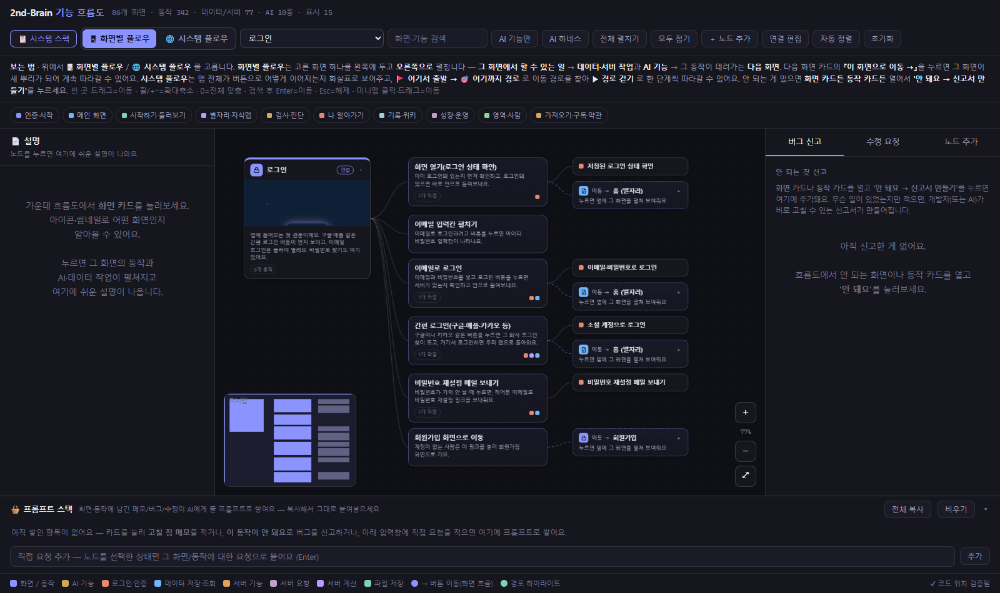
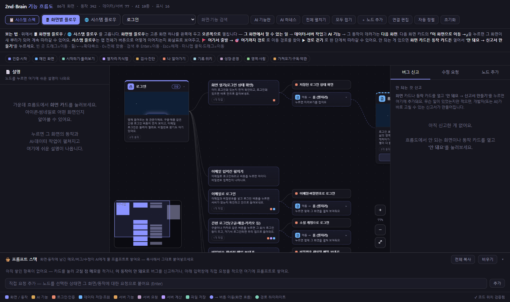
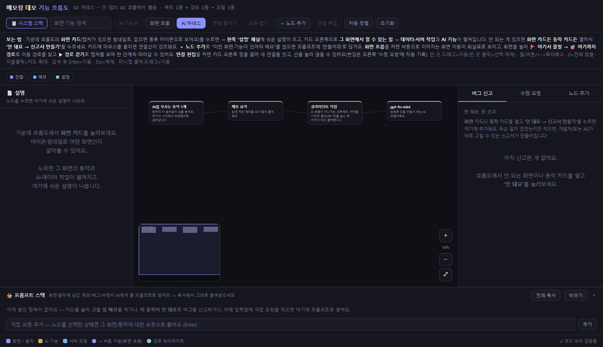

# Flow Debugger

비개발자가 자기 앱의 **워크플로우를 눈으로 보고 디버깅**하게 해주는 Claude Code 플러그인.

앱 화면을 전수 스캔해 `화면 → 사용자 동작 → 데이터/서버 작업 + AI`로 잇고, 각 동작에
**위험 마커 + 진단 체크리스트**를 붙여, "여기서 안 돼요"를 개발자(또는 코딩 에이전트)가 바로 고칠 수 있는
**버그 신고서**로 바꿔 보낼 수 있는 단일 자체완결 HTML을 만든다.

외부 의존성은 스크립트 실행용 `node` 뿐. 산출된 HTML은 네트워크를 전혀 쓰지 않는다(폰트 CDN도 없음).

## 이 도구의 핵심은 정밀도다

그림은 이해를 돕지만, 개발자에게 **실제로 전달되는 것은 `file:line` 한 줄**이다.
**틀린 좌표는 없는 것보다 나쁘다** — 에이전트가 프로덕션에 렌더되지도 않는 파일을 고치고, 빌드는 초록이고,
화면은 그대로다.

그래서 파이프라인에 **앵커 검증 단계**가 있고, 모든 좌표를 실제 소스트리에 대조한다:

- 파일이 존재하는가 · 줄이 범위 안인가 · **그 줄에 그 함수가 실제로 있는가**
- 줄 번호가 없으면 **심볼로 찾아 채우고**, 어긋난 줄은 **실제 위치로 보정**한다
- 빈 줄/import/주석을 가리키면 `~`, 함수가 없으면 `⚠`, 산문이면 좌표 자리에서 빼낸다
- 결과가 신고서에 **✔ / ~ / ⚠** 로 그대로 실려, 에이전트가 어디를 믿고 어디를 직접 찾을지 안다

실측(RN/Expo 앱, 86화면·342동작·547앵커): 신뢰 가능 **99.8%**, 산문 0, 깨진 좌표 0.
검증을 켜기 전 원본 데이터에는 **18%가 좌표조차 아닌 산문**이었다.

그리고 앵커가 **완벽히 유효한데도 쓸모없는 경우**가 있다 — 그 파일이 조건에 따라 다른 컴포넌트를
대신 렌더할 때(`if (isNewUI()) return <NotesScreenV2/>`). 검증기는 이것도 잡아 신고서에 경고를 싣는다.

## 미리보기

아래 이미지는 이 레포의 [`examples/demo-notes`](examples/demo-notes) 데모 앱을 그대로 맵핑한 결과다.

화면을 그룹별로 보여주고(유형 아이콘·위험 색점), 카드를 누르면 동작 → 데이터/서버 → AI로 펼쳐진다:



동작을 고르면 왼쪽 패널에 **검증된 코드 위치**(✔ 와 그 이유), 약점·진단 체크리스트, 실패 모드,
그리고 "이 동작이 안 돼요 → 신고서 만들기" 버튼이 뜬다:



**AI 하네스**는 이 앱의 AI 호출에서 그대로 파생된다(목적 → 경유 → 모델). 없는 단계를 지어내지 않는다:



## 데모로 5초 만에 확인하기

```bash
cd skills/flow-debugger
node scripts/verify-anchors.js ../../examples/demo-notes/flow/screenmap.debug.json ../../examples/demo-notes
node scripts/build.js assets/flow-debugger.template.html \
  ../../examples/demo-notes/flow/screenmap.debug.json \
  ../../examples/demo-notes/flow/glossary.ko.json \
  ../../examples/demo-notes/flow/flow-debugger.html \
  --app-root ../../examples/demo-notes
# examples/demo-notes/flow/flow-debugger.html 를 브라우저로 연다
```

데모에는 이 도구가 잡으라고 만들어진 함정이 일부러 들어 있다 — `src/notes.js` 가
`isNewUI()` 로 `<NotesScreenV2/>` 에 위임한다. 검증기가 그걸 찾아내고, 신고서가 경고한다.

## 설치 (플러그인)

```bash
# 1) 이 레포를 마켓플레이스로 추가
/plugin marketplace add Simon-YHKim/Flow-debugger
# 2) 플러그인 설치
/plugin install flow-debugger@flow-debugger
```

설치 후 `/flow-debugger:flow-debugger` 또는 "플로우 디버거 만들어 / 워크플로우 디버깅"으로 호출.

### 플러그인 없이 쓰기 (수동 복사)

```powershell
robocopy ".\skills\flow-debugger" "$env:USERPROFILE\.claude\skills\flow-debugger" /E
```

## 명령어 (`/flow*`)

스캔은 한 번(비쌈)이고, HTML(사람용)·핸드오프(AI용)는 그 스캔의 두 렌더다. 네 시점으로 나뉜다:

| 명령어 | 언제 | 하는 일 | 비용 |
|---|---|---|---|
| `/flow` | 처음 / 큰 변경 후 | 전수 스캔 → 검증 → **HTML + 핸드오프** | 비쌈(1회) |
| `/flow-handoff` | 넘길 때 | 현재 지도로 핸드오프만 재생성(재스캔 X) | 쌈 |
| `/flow-check` | 바뀐 것 같을 때 | 지문 대조로 낡음 점검 | 30초 |
| `/flow-watch` | 코딩하며 볼 때 | localhost 서빙 → 코드 저장/새로고침 때 배너로 변화 감지 | 상주 |
| `/flow-update` | 낡았을 때 | 화면별 **좌표만 밀림 vs 구조 바뀜** 분류 → 사용자에게 물어보고 이사/재스캔 → 재빌드 | 쌈~중간 |

`/flow-update` 는 코드를 고치기 전에 **분류**부터 한다: 좌표만 밀린 화면은 자동으로 옮기고(rebase),
버튼·화면·이동·서버호출이 추가/삭제된 화면은 **재스캔이 필요하다고 짚어** 사용자에게 물어본다.
rebase 는 없던 버튼을 못 만들기 때문 — 새 노드는 재스캔으로만 등장한다(지어내지 않는다).

**매일 쓰기**는 명령어가 아니다 — `flow-debugger.html`을 열어 클릭·순서편집·"안 돼요"로 프롬프트를 복사한다.
받는 사람은 `docs/FLOW-HANDOFF.md`만 읽으면 된다.

## 파이프라인 (`/flow` 내부)

스킬 발동 후 파이프라인을 돈다(프롬프트 전문: `skills/flow-debugger/references/scan-prompts.md`):

0. **프리스캔** `prescan.js` — 프로덕션 렌더 경로·게이트·헬퍼 인덱스를 **먼저** 파악(위임/숨은 AI 함정 예방)
1. **스캔** 화면 → 동작 → api/ai/앵커 추출 → `merge-readers.js`로 병합(+스키마 검사)
2. **한국어 보강** titleKo/groupKo/summaryKo/actionKo/plain + 용어집
3. **디버그 주석** risks / checklist / failureModes
4. **앵커 검증·보정** `verify-anchors.js` ← **정밀도의 전부. 건너뛰지 말 것**
5. **스크린샷**(선택) `capture-shots.js` → `embed-shots.js`
6. **빌드** `build.js`로 토큰 주입 + 백엔드 스캔 + 지문 기록 + JS 자가검증 → `flow-debugger.html`
7. **핸드오프** `make-handoff.js` — 새 세션이 읽는 `FLOW-HANDOFF.md` + 조회용 `flow-map.json` + 지문

앱이 바뀌면 지도는 낡는다. 그때:

```bash
node scripts/check-stale.js   <graph.json> <앱루트> --strict     # 낡았나? (CI 에 넣을 것)
node scripts/rebase-anchors.js <graph.json> <앱루트> --from <커밋>  # 낡았으면 좌표를 옮긴다(재스캔 없이)
node scripts/verify-anchors.js <graph.json> <앱루트> --strict     # 그리고 다시 증명한다
```

`rebase-anchors` 는 지도를 만든 커밋의 **그 줄 코드**를 읽어 지금 파일에서 같은 줄을 다시 찾는다 —
import 한 줄 추가로 아래가 전부 밀려도, 파일이 통째로 **이동/개명**돼도 좌표가 따라간다.
줄 자체가 **재작성**된 것만 목록으로 뱉고(추측 금지), 그 화면만 재스캔한다.

직접 돌리는 예 (스킬 폴더 기준):

```bash
# 4) 앵커를 실제 소스와 대조해 고친다
node scripts/verify-anchors.js Output/screenmap.debug.json <앱루트> --fix Output/screenmap.debug.json

# 6) 빌드 — --app-root 를 줘야 신고서 좌표에 ✔ 가 붙는다
node scripts/build.js assets/flow-debugger.template.html \
  Output/screenmap.debug.json Output/glossary.ko.json Output/shots.json \
  Output/flow-debugger.html --app-root <앱루트>

# 라이브 검증(선택): 겹침0 · pageerror0 · 위임경고 발화 · 서버뷰 · 순서편집(실드래그) · 템플릿 누수 없음
npm install && node scripts/verify-html.js Output/flow-debugger.html --template assets/flow-debugger.template.html
```

선택 사이드카(그래프 옆에 `<graph>.<이름>`으로 두면 자동 인식):

| 파일 | 용도 |
|---|---|
| `screenmap.debug.appname.txt` | 페이지 제목/브랜드에 쓸 앱 이름 한 줄 (없으면 "앱") |
| `screenmap.debug.stack.txt` | 프레임워크·백엔드·렌더 위임 한 줄 → 내보내는 프롬프트의 `[앱 스택]` |
| `screenmap.debug.mode.txt` | `ui`(기본) / `backend`(엔드포인트) / `cli`(명령) |
| `screenmap.debug.harness.json` | 이 앱의 AI 배선을 직접 그릴 때. 없으면 스캔한 AI 호출에서 **자동 파생** |

## 자동 갱신 — 코드가 바뀌면 흐름도가 따라온다 (v0.19–0.21)

지도(좌표)와 그림(썸네일)은 **따로** 낡는다. 손 안 대고 최신으로 유지하는 세 가지.

### 1) 바뀐 화면을 차트에 표시 — `flag-changed-screens.js`

지문 대비 소스가 바뀐 화면을 찾아, **차트 카드에 `⚠ 바뀜` 배지 + 호박색 틴트 + `그림 재확인` pill**을
stamp 한다(**🌐 시스템 플로우** 뷰에서 카드로 보인다). 비개발자가 열어도 어떤 화면이 실제와 달라졌는지
눈으로 안다.

```bash
node scripts/flag-changed-screens.js docs/flow-map.json <앱루트> --stamp docs/flow-debugger.html
```

한계: **소스 변경**을 잡는다. 코드는 그대로인데 그림만 옛것인 순수 시각 변경은 재캡처(아래 2)가 방어책.

### 2) 이미지 자동 재캡처 — CI (앱 레포)

PR이 화면 코드를 건드리면 **바뀐 화면만** 실제 웹빌드에서 다시 찍어 그 PR에 커밋한다. 흐름:

```
바뀐 파일 → 화면 라우트 매핑 → 웹 정적 export → serve → capture-shots --only --jpeg → stamp-shots → PR에 [skip ci] 커밋
```

- 캡처는 **정적 export**를 serve 한다(개발서버는 큰 앱에서 OOM). 로그인 화면은 로그아웃 상태로, 나머지는
  테스트 계정으로 로그인해서.
- `capture-shots.js --jpeg [품질=72]` — 작은 JPEG. 썸네일은 base64로 html에 박혀 커밋되므로, JPEG가
  그 파일(과 매 git blob)을 한 자릿수 작게 유지한다 — CI 기본값으로 알맞다.
- `stamp-shots.js` — 새 썸네일을 **바뀐 라우트만** html의 `SHOTS` 상수에 overlay(전체 재빌드 없이, 나머지
  썸네일 보존).
- 워크플로 실물 예시: 앱 레포의 `.github/workflows/flow-thumbnails.yml`. 핵심 스텝만:

```yaml
# PR이 src/** 를 바꾸면 → 바뀐 화면만 재캡처 → PR에 커밋 (best-effort, 실패해도 PR 안 깨짐)
- run: ROUTES=$(node scripts/flow/changed-screens.mjs origin/${{ github.base_ref }})   # 바뀐 파일 → 라우트
- run: npx expo export --platform web --output-dir dist && npx serve -s dist -l 8081 & # 실제 웹빌드
- run: git clone --depth 1 <flow-debugger> fd && (cd fd/skills/flow-debugger && npm install)
- run: node fd/.../capture-shots.js graph.json http://localhost:8081 out --only "$ROUTES" --jpeg 72
- run: node fd/.../stamp-shots.js docs/flow-debugger.html out/shots-map.json
- run: git commit -am "chore(flow-debugger): auto-refresh thumbnails [skip ci]" && git push
```

### 3) 세션 종료 시 자동 갱신 — Stop 훅

flow-debugger를 쓴 세션이 화면 코드를 고치고 끝나면, 종료 시 자동으로 **배지 표시 + 좌표 rebase**.
훅 스크립트를 `~/.claude/hooks/flow-debugger-autoupdate.mjs` 에 두고 `~/.claude/settings.json` 에 등록:

```json
{ "hooks": { "Stop": [ { "hooks": [
  { "type": "command", "command": "node ~/.claude/hooks/flow-debugger-autoupdate.mjs" }
] } ] } }
```

- 세션 끝에 낡음 점검 → 바뀐 화면에 배지 stamp + 스크린맵이 있으면 `rebase-anchors` 로 좌표 이사.
- flow-debugger가 없는 레포에선 **조용히 no-op**, 지도가 최신이면 아무것도 안 한다.
- **커밋은 안 한다**(작업트리만 갱신). 구조 변경(새 화면·버튼)은 배지 + `/flow-update` 안내 —
  새 노드는 재스캔으로만 등장한다(지어내지 않는 원칙 그대로).

> 역할 분담: **이미지=CI(2)** · **표시·좌표=Stop 훅(3)** · **구조 재스캔=`/flow-update`(사람 확인)**.

## 산출물 HTML이 주는 것

- 화면 카드(유형 아이콘·실제 스크린샷 썸네일)로 어떤 화면인지 인식
- 동작 카드의 **위험 색점**: 인터넷 필요·비용·AI·외부의존·로그인·기본꺼짐·조용한 실패 위험
- 동작 선택 시 **진단 체크리스트** + "이렇게 안 될 수 있어요"
- **버그 신고**: 화면 카드에서도 동작 카드에서도. 증상만 적으면(증상은 필수) 코드 위치·의존 작업·점검 포인트가
  박힌 신고서 자동 생성 — 각 좌표에 **✔ 확인됨 / ~ 주의 / ⚠ 믿지 말 것**
- **코드 위치 패널**: 카드마다 검증 결과와 이유를 한국어로
- **시스템 스펙**(📋): 스택·규모·서버작업·AI·위험 프로필 + **코드 위치 신뢰도**
- **AI 하네스**: 이 앱의 AI 호출에서 파생한 배선(목적 → 경유 → 모델). AI가 없으면 버튼도 없음
- **🌐 시스템 플로우 = 2층**
  - `↔ 이동 그래프` + **🔀 순서 편집**: 화면을 화살표 위에 드롭하면 그 사이에 끼워짐(A→B 에 C → **A→C→B**).
    화살표는 **버튼**이므로, 바뀐 순서는 *"홈의 『담기』 버튼(src/…:120)이 이제 C로 가야 해"* 라는 **실제 코드 변경 요청**으로 나감
  - `🗄 서버·데이터`: **화면 → 서버작업 → 서버함수 → 테이블(RLS·정책)**. 앱의 서버 코드·스키마에서 파생
    (Supabase 엣지·Next 라우트·Express·Netlify / SQL·Prisma·Drizzle). 서버 없는 앱이면 안 뜸
- **내보내는 프롬프트가 "의논하라"고 요구**: LLM 을 부르지 않고 **명령 패턴**만 쓴다. 방법이 둘 이상이면 바로 고르지 말고
  장단점·영향 범위를 정리해 사용자와 정한 뒤 진행하라고 지시(플러그인 자체는 AI 호출 없음)
- **연결 편집 / 노드 추가 / 프롬프트 스택**(수정 요청을 프롬프트로 모아 복사)
- 겹침 방지 자동 배치, 한국어, 미니맵/줌, 그룹 필터, localStorage 저장

## 구성

```
Flow-debugger/
  .claude-plugin/
    plugin.json  marketplace.json
  skills/flow-debugger/
    SKILL.md
    package.json                         playwright (캡처·라이브검증용 devDep)
    assets/flow-debugger.template.html   토큰: __GRAPH_JSON__ __GLOSSARY_JSON__ __SHOTS_JSON__
                                               __STACK_JSON__ __ANCHORS_JSON__ __HARNESS_JSON__
                                               __BACKEND_JSON__ __STAMP_JSON__ __IDENTITY_JSON__
                                               __STALE_JSON__ __APP_NAME__ __MODE__
    scripts/
      lib/anchors.js        앵커 파싱·해석·검증 엔진 (이 도구의 심장)
      verify-anchors.js     앵커를 실제 소스트리에 대조·보정  ← 4단계
      merge-readers.js      리더 출력 병합 + 스키마 검사
      apply-anchors.js      RESCAN 패치 병합 (한국어·위험 보존)
      prescan.js            프로덕션 렌더 경로·게이트·헬퍼 인덱스 (0단계)
      capture-shots.js      라우트별 스크린샷 (`--jpeg` 로 작은 JPEG)
      embed-shots.js        base64 임베드
      stamp-shots.js        새 썸네일을 바뀐 라우트만 html SHOTS에 overlay (CI 재캡처용)
      flag-changed-screens.js  바뀐 화면을 STALE 배지로 차트에 stamp (표시)
      lib/backend.js        서버 핸들러·테이블·RLS 스캔 → 서버·데이터 뷰
      lib/fingerprint.js    지문(커밋 + 앵커한 파일 해시)
      lib/reach.js          렌더 모드·게이트·헬퍼(AI SDK import) 탐지
      build.js              토큰 주입 + 앵커 감사 + 백엔드 + 지문 + JS 자가검증
      check-stale.js        지도가 낡았는지 숫자로 답함 (CI 용)
      rebase-anchors.js     코드가 움직이면 좌표를 따라 옮김(이동/개명/줄밀림)
      make-handoff.js       새 세션용 핸드오프 3종 생성
      verify-html.js        라이브 검증(브라우저): 위임경고·서버뷰·순서편집까지
      self-test.js          앵커 엔진 + 드리프트 복구 단위 테스트 (node만, 59 케이스)
    references/
      scan-prompts.md       SCAN / ENRICH / GLOSSARY / ANNOTATE / RESCAN
      capture-shots.md      캡처 뜨는 법
    evals/
  README.md  LICENSE  CHANGELOG.md
```

## 테스트

```bash
cd skills/flow-debugger
node scripts/self-test.js      # 앵커 엔진 + 드리프트 복구 59 케이스, 브라우저·네트워크 불필요
npm install && node scripts/verify-html.js <built.html> --template assets/flow-debugger.template.html
```

## 라이선스

MIT (c) 2026 Simon Kim.
